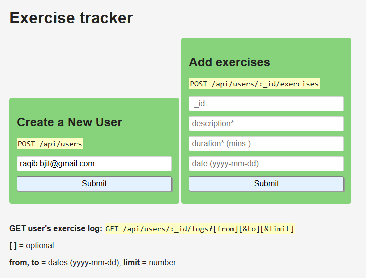

# Exercise Tracker

Exercise Tracker project based on:
[freeCodeCamp - Exercise Tracker Project](https://www.freecodecamp.org/learn/apis-and-microservices/apis-and-microservices-projects/exercise-tracker)

## Tech

| Technology     | Purpose                                                            |
| -------------- | ------------------------------------------------------------------ |
| **Node.js**    | JavaScript runtime environment.                                    |
| **Express.js** | Web framework for building APIs.                                   |
| **MongoDB**    | NoSQL database for storing user and exercise data.                 |
| **Mongoose**   | ODM (Object Data Modeling) library for MongoDB and Node.js.        |
| **dotenv**     | Loads environment variables from a `.env` file into `process.env`. |

## How to run

1. **Download the project folder**  
   Download this folder to your local machine.

2. **Navigate into the project directory**

    ```bash
    cd boilerplate-project-exercisetracker
    ```

3. Add **.env** file with MONGO_URI for database connection.

4. **Install dependencies**

    ```bash
    npm install
    ```

5. **Start the server**

    ```bash
    npm start
    ```

    The server will run on [http://localhost:3000](http://localhost:3000) by default.

## Features

-   **Create a new user:**  
    `POST /api/users`  
    Add a new user by sending a username.

-   **Get all users:**  
    `GET /api/users`  
    Retrieve a list of all registered users.

-   **Add an exercise:**  
    `POST /api/users/:_id/exercises`  
    Add an exercise for a specific user by providing description, duration, and date.

-   **Get a user's exercise log:**  
    `GET /api/users/:_id/logs`  
    Retrieve a user's exercise log with optional query parameters (`from`, `to`, `limit`) to filter results.

## Screenshot



## License

This project is for educational purposes as part of the freeCodeCamp curriculum.
