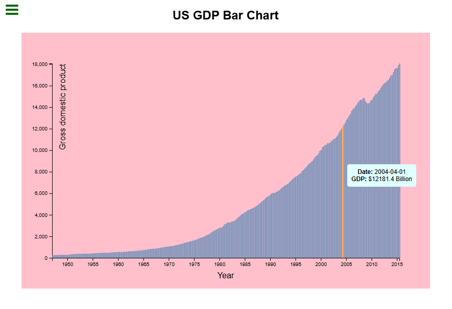

# Visualize Data with a Bar Chart

This project is a solution to the [freeCodeCamp - Visualize Data with a Bar Chart challenge](https://www.freecodecamp.org/learn/data-visualization/data-visualization-projects/visualize-data-with-a-bar-chart). It uses D3.js to render a responsive bar chart that visualizes United States GDP data.

## Features

-   Fetches and displays GDP data as a bar chart
-   Responsive SVG layout
-   Interactive tooltips on hover
-   Accessible and semantic markup

## Technologies

-   HTML5
-   CSS3
-   [D3.js](https://d3js.org/)

## Usage

1. Download this folder.
2. Open `index.html` in your browser.

## Project Reference

[freeCodeCamp: Visualize Data with a Bar Chart](https://www.freecodecamp.org/learn/data-visualization/data-visualization-projects/visualize-data-with-a-bar-chart)

## Screenshot

## License

This project is for educational purposes.
