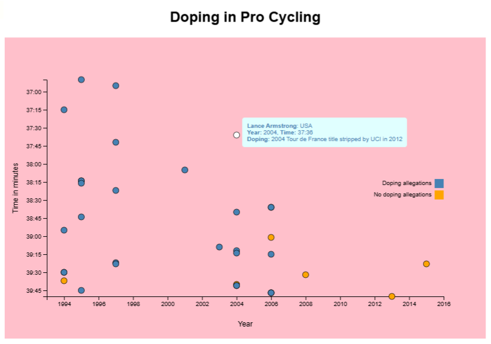

# Scatter Plot Cyclist Doping

This project visualizes professional cycling data using a scatter plot to highlight doping allegations among cyclists.

## Features

-   Interactive D3.js scatter plot
-   Visualization of time, ranking, and doping allegations
-   Responsive and accessible design
-   Tooltip displays cyclist details on hover

## Data Endpoint

The cyclist data is loaded from the following endpoint:

[https://raw.githubusercontent.com/freeCodeCamp/ProjectReferenceData/master/cyclist-data.json](https://raw.githubusercontent.com/freeCodeCamp/ProjectReferenceData/master/cyclist-data.json)

## Getting Started

1. Clone the repository.
2. Open `index.html` in your browser.

## Project Reference

This project is based on:

[freeCodeCamp - Visualize Data with a Scatterplot Graph](https://www.freecodecamp.org/learn/data-visualization/data-visualization-projects/visualize-data-with-a-scatterplot-graph)

## Screenshot

## License

This project is for educational purposes as part of the freeCodeCamp curriculum.
